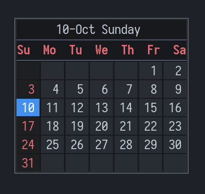
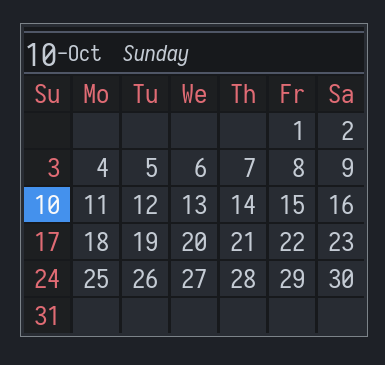
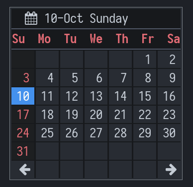

# rofi-cal

Simple minimal calendar using rofi.
These are template scripts and themes. You can make your own based on them and do something with the date you picked
like in first script `launch.sh` I use the date picked to open a journal for that date. You can add more options by 
modifying the script.

- `launch.sh` - uses `theme.rasi`

- `launch2.sh` - uses `theme2.rasi`

- `launch3.sh` - uses `theme3.rasi`

